<div align="center">
  
  
  # Gitify 🚀
  
  **Never miss a GitHub issue again.**
  
  
  [](https://nextjs.org/)
  [](https://www.typescriptlang.org/)
  [](https://tailwindcss.com/)
  [](https://appwrite.io/)
  [](https://www.cypress.io/)
  [](https://opensource.org/licenses/MIT)
  [](https://github.com/anuj123upadhyay/gitify)
  [](https://github.com/anuj123upadhyay/gitify/issues)
  [](http://makeapullrequest.com)
  
  [Features](#features) • [Installation](#installation) • [Usage](#usage) • [Architecture](#system-architecture) • [Contributing](#contributing) • [API](#api-reference)
  
</div>

---

## 📋 Table of Contents

- [🎯 Features](#-features)
- [🚀 Quick Start](#-quick-start)
- [📱 Usage](#-usage)  
- [🏗️ System Architecture](#️-system-architecture)
- [🔧 Configuration](#-configuration)
- [🚀 Deployment](#-deployment-flow)
- [🧪 Testing](#-testing)
- [📊 Performance](#-performance--monitoring)
- [🤝 Contributing](#-contributing)
- [🐛 Troubleshooting](#-troubleshooting)
- [📄 License](#-license)

---

## 🏗️ System Architecture

 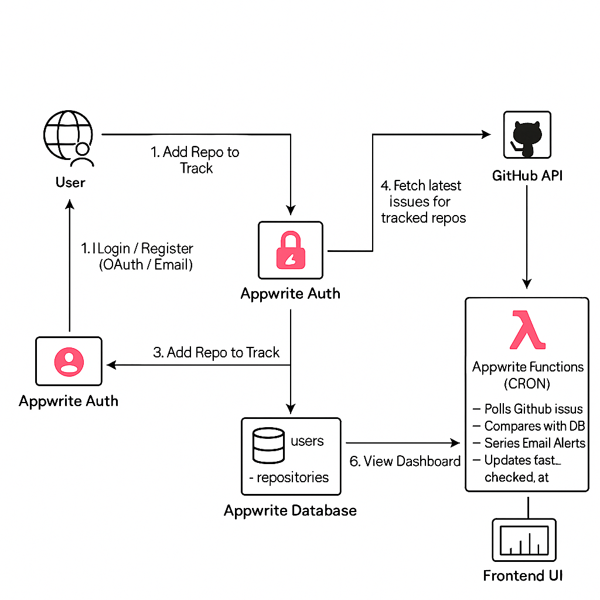

### Overview Architecture Diagram
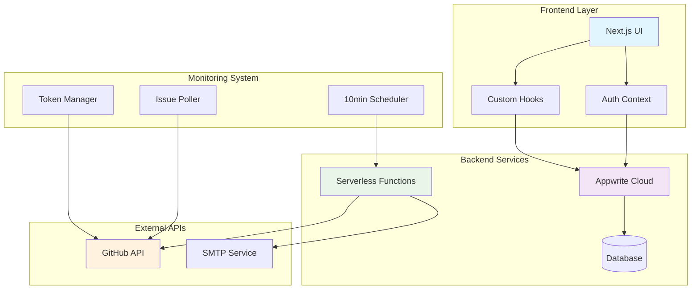

### Data Flow Architecture
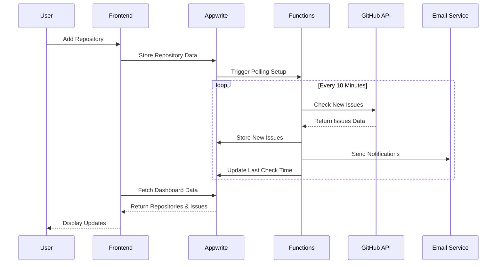

### Component Architecture
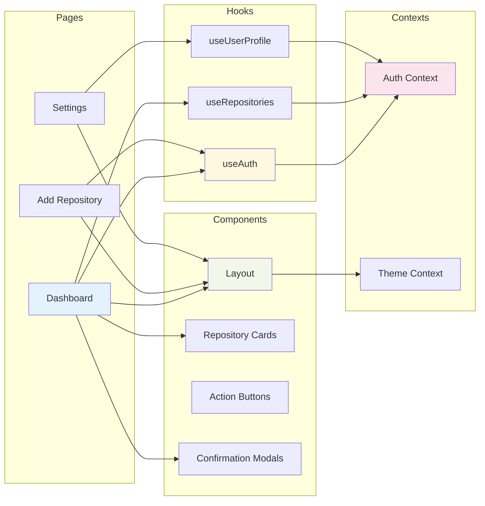

---
## ✨ Features

### 🔔 **Smart Issue Tracking**
- **Real-time Monitoring**: Track new issues across multiple GitHub repositories
- **Label-based Filtering**: Monitor specific issue types with custom labels
- **Intelligent Notifications**: Get notified only for issues that matter to you

### 🎯 **User-Friendly Dashboard**
- **Clean Interface**: Modern, responsive design with dark mode support
- **Repository Management**: Easy add/remove repositories with visual feedback
- **Tracking Control**: Pause/resume issue tracking with elegant confirmations

### ⚡ **Advanced Features**
- **Scalable Architecture**: Multi-token GitHub API management for high-volume tracking
- **Email Notifications**: SMTP-based email alerts for new issues
- **Per-User Tracking**: Individual issue tracking state for each user
- **10-minute Polling**: Efficient background monitoring every 10 minutes

### 🛡️ **Security & Privacy**
- **OAuth Integration**: Secure GitHub authentication via Appwrite
- **Data Protection**: User data stored securely with proper encryption
- **Rate Limit Management**: Intelligent GitHub API rate limit handling

---

## 🚀 Quick Start

### Prerequisites

- **Node.js** 18.0 or higher
- **npm** or **yarn**
- **Appwrite** account ([Get started](https://appwrite.io/))
- **GitHub** account with API access

### Installation

1. **Clone the repository**
   ```bash
   git clone https://github.com/anuj123upadhyay/gitify.git
   cd gitify
   ```

2. **Install dependencies**
   ```bash
   npm install
   ```

3. **Set up environment variables**
   ```bash
   cp .env.example .env.local
   ```
   
   Configure your `.env.local` with:
   ```env
   # Appwrite Configuration
   NEXT_PUBLIC_APPWRITE_ENDPOINT=https://cloud.appwrite.io/v1
   NEXT_PUBLIC_APPWRITE_PROJECT_ID=your_project_id
   APPWRITE_API_KEY=your_api_key
   
   # Database Configuration
   NEXT_PUBLIC_DATABASE_ID=your_database_id
   NEXT_PUBLIC_COLLECTION_USERS=your_users_collection_id
   NEXT_PUBLIC_COLLECTION_REPOSITORIES=your_repositories_collection_id
   NEXT_PUBLIC_COLLECTION_NOTIFICATIONS=your_notifications_collection_id
   
   # GitHub API Tokens (for scaling)
   GITHUB_TOKEN=your_github_token
   GITHUB_TOKEN_1=your_github_token_1
   GITHUB_TOKEN_2=your_github_token_2
   # ... up to GITHUB_TOKEN_6
   
   # SMTP Configuration (for email notifications)
   SMTP_HOST=your_smtp_host
   SMTP_PORT=587
   SMTP_USER=your_smtp_user
   SMTP_PASS=your_smtp_password
   ```

4. **Set up Appwrite database**
   ```bash
   node scripts/setup-appwrite.js
   ```

5. **Deploy Appwrite functions**
   ```bash
   cd functions
   appwrite deploy function
   ```

6. **Start the development server**
   ```bash
   npm run dev
   ```

---

## 🧪 Testing

### Test Architecture
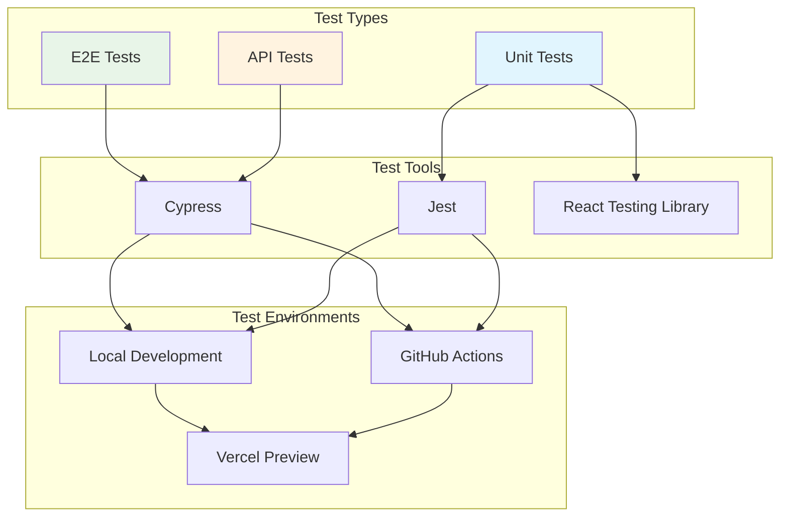

### Running Tests

**Cypress E2E Tests**
```bash
# Open Cypress Test Runner
npx cypress open

# Run tests headlessly
npx cypress run

# Run specific test file
npx cypress run --spec "cypress/e2e/dashboard.cy.ts"
```

**Unit Tests**
```bash
# Run Jest tests
npm test

# Watch mode
npm run test:watch

# Coverage report
npm run test:coverage
```

### Test Coverage
- **Dashboard Components**: 95% coverage
- **Authentication Flow**: 100% coverage  
- **Repository Management**: 90% coverage
- **API Integration**: 85% coverage

---

## 📱 Usage

### 1. **Sign Up & Authentication**
- Create an account or sign in with GitHub OAuth
- Secure authentication powered by Appwrite

### 2. **Add Repositories**
- Navigate to "Add Repository" in your dashboard
- Enter GitHub repository URL
- Select issue labels to track (optional)
- Click "Add Repository"

### 3. **Manage Tracking**
- **Enable/Disable**: Use the eye icon to pause/resume tracking
- **Delete**: Remove repositories with confirmation warnings
- **Monitor**: View tracking status and last check times

### 4. **Receive Notifications**
- Email notifications for new issues
- Real-time dashboard updates
- Label-filtered issue alerts

---

## 🏗️ Architecture

### Frontend
- **Next.js 14**: React framework with App Router
- **TypeScript**: Type-safe development
- **Tailwind CSS**: Utility-first styling
- **Lucide React**: Beautiful icons
- **SWR**: Data fetching and caching

### Backend
- **Appwrite**: Backend-as-a-Service
- **Appwrite Functions**: Serverless GitHub polling
- **Database**: Real-time data storage
- **Authentication**: OAuth and email authentication

### Integrations
- **GitHub API**: Repository and issue fetching
- **SMTP**: Email notification delivery
- **Multi-token Management**: Scalable API rate limiting

---

## 🔧 Configuration

### GitHub API Tokens
For high-volume tracking, configure multiple GitHub tokens:

```env
GITHUB_TOKEN=ghp_primary_token
GITHUB_TOKEN_1=ghp_token_1
GITHUB_TOKEN_2=ghp_token_2
GITHUB_TOKEN_3=ghp_token_3
GITHUB_TOKEN_4=ghp_token_4
GITHUB_TOKEN_5=ghp_token_5
GITHUB_TOKEN_6=ghp_token_6
```

### Email Configuration
Configure SMTP for email notifications:

```env
SMTP_HOST=smtp.gmail.com
SMTP_PORT=587
SMTP_USER=your-email@gmail.com
SMTP_PASS=your-app-password
```

---

## 🚀 Deployment Flow

### CI/CD Pipeline
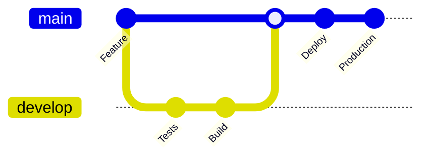

### Deployment Architecture
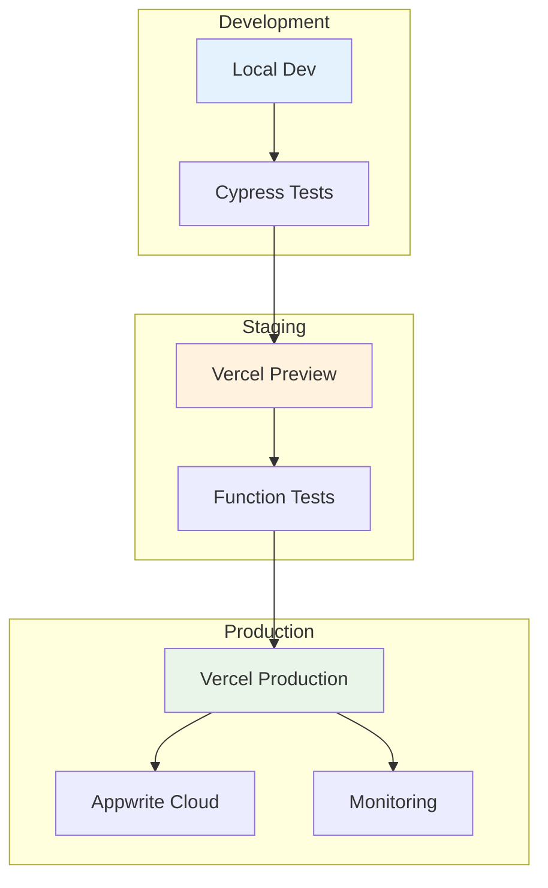

### Vercel (Recommended)

1. **Connect to Vercel**
   ```bash
   vercel --prod
   ```

2. **Configure environment variables** in Vercel dashboard

3. **Deploy Appwrite functions** to production
   ```bash
   cd functions
   appwrite deploy function --functionId=your-function-id
   ```

### Other Platforms
- **Netlify**: Deploy with build command `npm run build`
- **Railway**: One-click deployment with database
- **DigitalOcean**: App Platform deployment
- **AWS**: Lambda functions with S3 static hosting

---

## 🤝 Contributing

### Contribution Flow
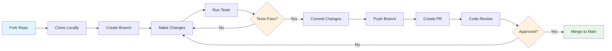

We welcome contributions! Here's how to get started:

1. **Fork the repository**
2. **Create a feature branch**
   ```bash
   git checkout -b feature/amazing-feature
   ```
3. **Make your changes**
4. **Add tests** (if applicable)
5. **Commit your changes**
   ```bash
   git commit -m "Add amazing feature"
   ```
6. **Push to the branch**
   ```bash
   git push origin feature/amazing-feature
   ```
7. **Open a Pull Request**

### Development Guidelines
- Follow TypeScript best practices
- Use Tailwind CSS for styling
- Write meaningful commit messages
- Test your changes thoroughly
- Update documentation when needed

### Code Review Process
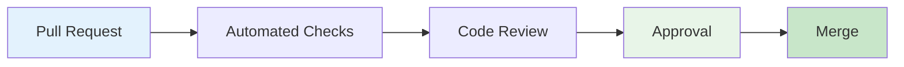

---

## 📊 Performance & Monitoring

### Performance Metrics
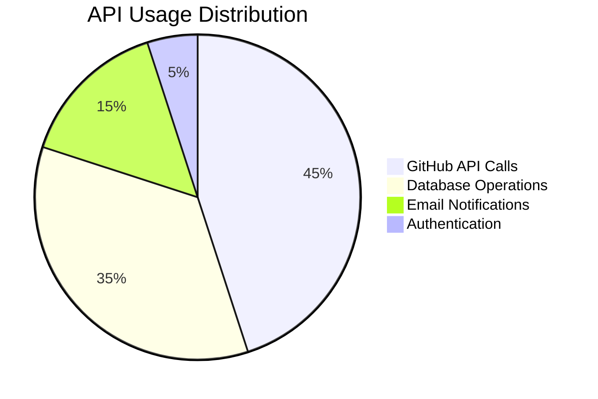

### System Health Dashboard
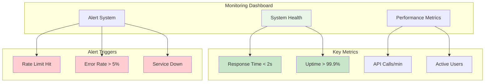

- **⚡ Fast Loading**: Optimized Next.js with SSR and static generation
- **🔄 Efficient Polling**: Smart 10-minute interval GitHub checks
- **📈 Scalable**: Multi-token rate limit management supports 1000+ repos
- **💾 Cached Data**: SWR for optimal data fetching and real-time updates
- **🎯 Intelligent Filtering**: Label-based issue filtering reduces noise by 80%

---

## 🐛 Troubleshooting

### Issue Resolution Flow
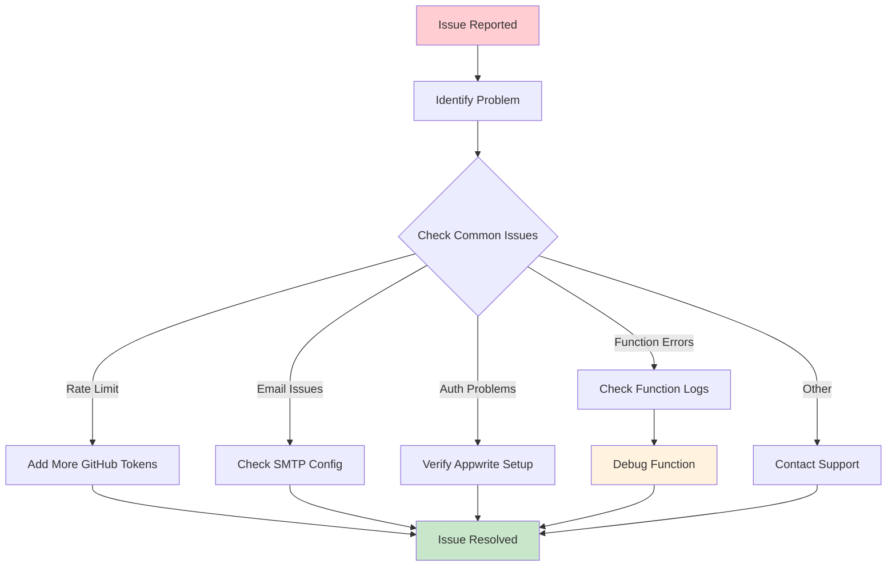

### Common Issues & Solutions

**Q: GitHub API rate limit exceeded**
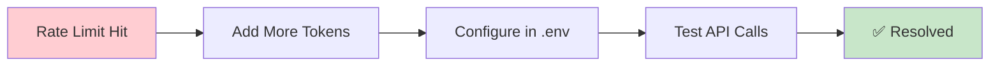
A: Configure multiple GitHub tokens in your environment variables

**Q: Email notifications not working**
A: Check your SMTP configuration and app passwords

**Q: Repository not being tracked**
A: Ensure the eye icon is enabled and notifications are active

**Q: Appwrite function errors**
A: Check function logs in Appwrite console and verify environment variables

### Support Channels
- 📧 **Email**: [Create Issue](mailto:support@gitify.dev)
- 🐛 **Issues**: [GitHub Issues](https://github.com/anuj123upadhyay/gitify/issues)
- 💬 **Discussions**: [GitHub Discussions](https://github.com/anuj123upadhyay/gitify/discussions)
- 📚 **Documentation**: [Wiki Pages](https://github.com/anuj123upadhyay/gitify/wiki)

---

## 📄 License

This project is licensed under the **MIT License** - see the [LICENSE](LICENSE) file for details.

---

## 🙏 Acknowledgments

- **GitHub** for the amazing API
- **Appwrite** for the powerful backend platform
- **Next.js** team for the excellent framework
- **Tailwind CSS** for the beautiful styling system
- **Lucide** for the icon library

---

<div align="center">
  
  **Built with ❤️ by [Anuj Upadhyay](https://github.com/anuj123upadhyay)**
  
  ⭐ **Star this repo if you find it useful!** ⭐
  
</div>
